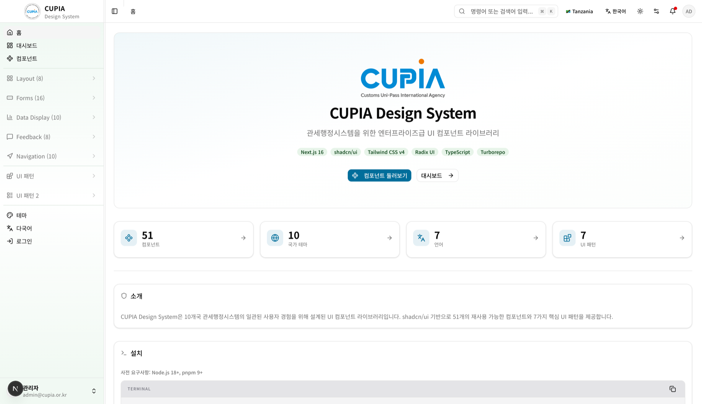

# CUPIA Design System

CUPIA 관세행정시스템(Customs Administration System)을 위한 UI 컴포넌트 라이브러리 및 디자인 시스템 문서 사이트.



## Tech Stack

| Category | Technology |
|----------|-----------|
| Monorepo | pnpm workspaces + Turborepo |
| Framework | Next.js 16.1.6 (App Router) |
| Components | shadcn/ui (radix-nova style) |
| Styling | Tailwind CSS v4 + OKLCh CSS variables |
| i18n | next-intl 4.8.3 |
| Language | TypeScript 5.9 |
| Runtime | React 19 |

## Features

- **51 UI Components** — shadcn/ui `@workspace/ui/components/*`
- **10 Country Themes** — KR, EC, ET, DZ, GH, CM, UZ, TZ, NP, GT (OKLCh CSS variables)
- **7 Languages** — ko, en, es, fr, ar, ja, zh
- **7 UI Patterns** — Search+Table, Dashboard, Complex Form, Master-Detail, Workflow, Calendar, Advanced Search
- **Design Token Documentation** — Colors, typography, spacing, radius, dark mode
- **Syntax-Highlighted Code Blocks** — Shiki dual-theme (github-light / github-dark)
- **Static Export** — GitHub Pages 배포

## Project Structure

```
ui-design-system/
├── apps/
│   └── docs/                      # Next.js 문서 사이트
│       ├── app/[locale]/(main)/   # 로케일 기반 라우팅
│       │   ├── components/        # 컴포넌트 카탈로그 + 상세 페이지
│       │   ├── themes/            # 디자인 토큰 문서
│       │   ├── i18n/              # 다국어 설정 페이지
│       │   ├── patterns/          # 7가지 UI 패턴 데모
│       │   └── dashboard/         # 대시보드 데모
│       ├── components/            # 앱 컴포넌트 (sidebar, code-block 등)
│       ├── i18n/messages/         # 번역 파일 (7개 언어)
│       └── lib/                   # component-registry 등
├── packages/
│   ├── ui/                        # @workspace/ui 컴포넌트 라이브러리
│   │   ├── src/components/        # 51개 shadcn 컴포넌트
│   │   └── src/styles/            # globals.css (OKLCh 테마 변수)
│   ├── eslint-config/             # 공유 ESLint 설정
│   └── typescript-config/         # 공유 TypeScript 설정
├── .github/workflows/             # GitHub Pages 자동 배포
├── turbo.json
└── package.json
```

## Getting Started

### Prerequisites

- Node.js >= 20
- pnpm 10.4+

### Installation

```bash
# Clone
git clone https://github.com/slipknot-yang/ui-design-system.git
cd ui-design-system

# Install dependencies
pnpm install

# Start dev server
pnpm dev --filter docs
```

Open [http://localhost:3000](http://localhost:3000) to view the docs site.

### Build

```bash
# Build all packages
pnpm turbo build

# Type check
pnpm turbo typecheck
```

## Adding Components

shadcn CLI를 사용하여 컴포넌트를 추가합니다:

```bash
pnpm dlx shadcn@latest add <component> -y -o -c apps/docs
```

Components are installed to `packages/ui/src/components/`.

## Using Components

```tsx
import { Button } from "@workspace/ui/components/button";
import { Card, CardContent, CardHeader, CardTitle } from "@workspace/ui/components/card";
import { Input } from "@workspace/ui/components/input";
import { Table, TableBody, TableCell, TableHead, TableHeader, TableRow } from "@workspace/ui/components/table";
```

## Available Components (51)

| Category | Components |
|----------|-----------|
| **Layout** | Accordion, Card, Separator, Tabs, Resizable, Aspect Ratio, Scroll Area, Collapsible |
| **Forms** | Button, Checkbox, Input, Label, Radio Group, Select, Switch, Textarea, Toggle, Toggle Group, Slider, Input OTP, Input Group, Field, Item |
| **Data Display** | Table, Badge, Avatar, Calendar, Carousel, Progress, Skeleton, Chart, Empty, Kbd |
| **Feedback** | Alert, Alert Dialog, Dialog, Drawer, Sheet, Sonner, Tooltip, Hover Card, Popover, Spinner |
| **Navigation** | Breadcrumb, Command, Context Menu, Dropdown Menu, Menubar, Navigation Menu, Pagination, Sidebar, Combobox |

## UI Patterns

관세행정시스템에서 자주 사용되는 7가지 UI 패턴:

| Pattern | Description |
|---------|------------|
| **Search + Table** | 검색 조건 + 결과 테이블 (전체 페이지의 ~60%) |
| **Dashboard** | KPI 카드 + 차트 + 최근 활동 |
| **Complex Form** | 다단계 입력 폼 + 유효성 검사 |
| **Master-Detail** | 목록 선택 → 상세 정보 |
| **Workflow** | 단계별 프로세스 (신고/심사/허가) |
| **Calendar** | 일정 관리 + 이벤트 |
| **Advanced Search** | 다중 조건 + 필터 + 저장된 검색 |

## Country Themes

10개 국가별 테마가 `data-country-theme` 속성으로 적용됩니다:

```html
<html data-country-theme="kr">
```

| Code | Country |
|------|---------|
| KR | Korea (default) |
| EC | Ecuador |
| ET | Ethiopia |
| DZ | Algeria |
| GH | Ghana |
| CM | Cameroon |
| UZ | Uzbekistan |
| TZ | Tanzania |
| NP | Nepal |
| GT | Guatemala |

## Deployment

GitHub Actions를 통해 `main` 브랜치 push 시 GitHub Pages로 자동 배포됩니다.

```yaml
# .github/workflows/deploy.yml
# Static export (output: 'export') + basePath: '/ui-design-system'
```

## License

Private
